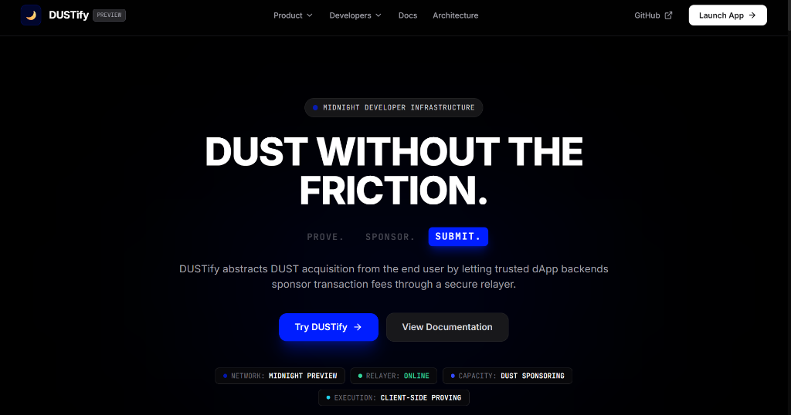
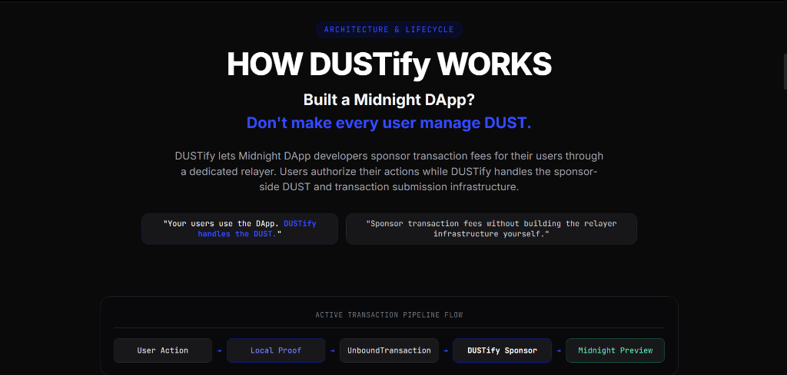
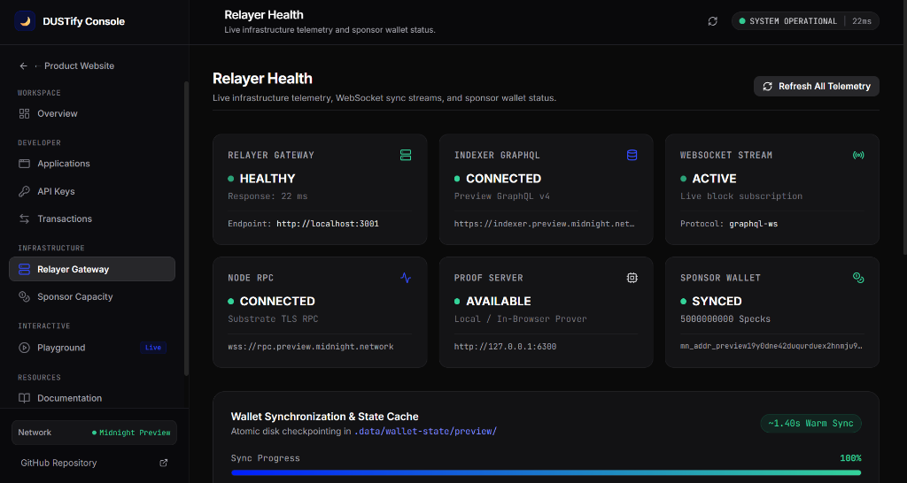

# 🌙 DUSTify
### Zero-Friction DUST Sponsorship & Fee-Abstraction Infrastructure for Midnight

DUSTify enables Midnight dApps to sponsor transaction fees for users. Users generate transaction proofs locally while a sponsor relayer supplies DUST and submits the finalized transaction to Midnight Preview.

[](https://midnight.network)
[](https://docs.midnight.network)
[](https://indexer.preview.midnight.network)
[](https://github.com/yashannadate/DUSTify/actions)

---

### 🌐 [Live App (https://dustify-midnight.vercel.app)](https://dustify-midnight.vercel.app) • 🎥 [Demo Video](https://drive.google.com/drive/folders/1gIjgNqdXhDRKjw-XyILOnRY8HyP29qY6)

---

<p align="center">
  
</p>

---

## 📑 Table of Contents

1. [📖 What is DUSTify?](#-what-is-dustify)
2. [🎥 Demo Video](#-demo-video)
3. [⚡ Reviewer Quick Start](#-reviewer-quick-start)
4. [🏗️ Architecture](#-architecture)
5. [🔄 How Sponsorship Works](#-how-sponsorship-works)
6. [🎯 Level 4 Scope & Boundaries](#-level-4-scope--boundaries)
7. [🔌 API Usage & Client SDK Guide](#-api-usage--client-sdk-guide)
8. [🔐 Security & Trust Model](#-security--trust-model)
9. [🌐 Preview Deployment Details](#-preview-deployment-details)
10. [🧪 Testing & Verification](#-testing--verification)
11. [⚠️ Current Limitations & Technical Honesty](#-current-limitations--technical-honesty)
12. [📊 Roadmap (Moonshot Phases)](#-roadmap-moonshot-phases)
13. [📄 Level 4 Reviewer Evidence Matrix](#-level-4-reviewer-evidence-matrix)
14. [📜 License & Acknowledgments](#-license--acknowledgments)

---

## 📖 What is DUSTify?

**DUSTify** is a transaction fee-abstraction and meta-transaction relayer engineered for the **Midnight Network**. It solves the critical onboarding bottleneck in privacy-preserving Web3 applications: the requirement that every end-user must acquire native gas tokens (`DUST`), navigate external faucets, and wait for token generation cycles before submitting their first transaction.

In Midnight's dual-token resource model:
- **NIGHT** is the unshielded capital asset. Holding NIGHT tokens continuously generates DUST.
- **DUST** is the shielded, non-transferable resource used exclusively to pay for transaction fees and smart contract execution.

Because DUST cannot be directly transferred between arbitrary user wallets, onboarding new users traditionally requires them to acquire `tNIGHT`, register unshielded UTXOs for DUST generation, and wait for generation cycles before performing any on-chain action.

DUSTify decouples **application zero-knowledge proof generation** from **transaction fee payment and blockchain submission**. A user generates ZK proofs locally on their device with 0 DUST required from them. The un-gas-backed `UnboundTransaction` is routed via `@dustify/sdk` to an authenticated Master Relayer, which balances the transaction using sponsor-owned DUST capacity and settles it on the **Midnight Preview Network** in a single atomic flow.

---

## 🎥 Demo Video

> 🎬 **Demo Video & Walkthrough Folder:**  
> **[Demo Video](https://drive.google.com/drive/folders/1gIjgNqdXhDRKjw-XyILOnRY8HyP29qY6)**  
> Link: `https://drive.google.com/drive/folders/1gIjgNqdXhDRKjw-XyILOnRY8HyP29qY6`

### What the Demonstration Shows:
1. **Zero-Gas User Entry:** Opening the DUSTify frontend with 0 DUST in user wallet (0 DUST paid by the end user).
2. **Preview Network Connectivity:** Real-time pulse indicator confirming Midnight Preview connection (`wss://rpc.preview.midnight.network`).
3. **Relayer Telemetry Check:** Live inspection of Relayer health, applied block index, and Master Sponsor address.
4. **Local Witness Proving:** State mutation in `hello-world.compact` evaluated locally on client (private witness remains in client memory).
5. **WASM Binary Handoff:** Client SDK serializing `UnboundTransaction` and transmitting over authenticated HTTP.
6. **Sponsor Fee Attachment:** Backend Relayer executing `balanceUnboundTransaction()` with Master Sponsor Wallet.
7. **Recipe Sealing:** `finalizeRecipe()` converting recipe to `FinalizedTransaction`.
8. **Node RPC Broadcast:** Transaction broadcast to `wss://rpc.preview.midnight.network`.
9. **On-Chain Confirmation:** Real-time display of confirmed Transaction ID (TxID).
10. **Explorer Verification:** Viewing the public state mutation on the Midnight Preview Indexer.

---

## ⚡ Reviewer Quick Start

To verify and run DUSTify locally against the live Midnight Preview Network:

1. **Clone repository:**
   ```bash
   git clone https://github.com/yashannadate/DUSTify.git
   cd DUSTify
   ```
2. **Configure environment:**
   ```bash
   cp .env.example .env
   # Pre-configured with Midnight Preview endpoints; .env is gitignored
   ```
3. **Start local Proof Server (Docker):**
   ```bash
   docker run -d --name midnight-proof-server -p 6300:6300 midnightnetwork/proof-server:latest
   ```
4. **Start DUSTify Master Relayer (WSL2 Ubuntu):**
   ```bash
   npm run dev:relayer
   # Starts Express gateway on http://localhost:3001 and restores warm wallet state (~1.40s)
   ```
5. **Start Frontend Dashboard:**
   ```bash
   npm run dev:frontend
   # Launches Vite development server on http://localhost:5173
   ```
6. **Open Dashboard:** Navigate to `http://localhost:5173` in your browser.
7. **Check Relayer Health:** Verify live sync and DUST capacity on the **Relayer Health** tab or `GET /api/v1/status`.
8. **Execute Demo Transaction:** Open the **Playground** tab to trigger a sponsored state mutation on `hello-world.compact`.
9. **Verify On-Chain:** Inspect the resulting transaction hash via Midnight Preview GraphQL Indexer.

---

## 🏗️ Architecture

```
User / dApp
    ↓
Client-side Compact execution + ZK proof (Private witness remains in local memory)
    ↓
Serialized transaction payload (UnboundTransaction binary hex)
    ↓
DUSTify Relayer (POST /api/v1/relay, x-api-key authenticated)
    ↓
Sponsor DUST (Master Sponsor Wallet balances fee with balanceUnboundTransaction)
    ↓
Midnight Preview (FinalizedTransaction broadcast via wss://rpc.preview.midnight.network)
```

### Component Responsibilities

| Component | Primary Responsibility | Gas Cost | Privacy Boundary |
| :--- | :--- | :---: | :--- |
| **Frontend dApp** | User interface & action trigger | 0 DUST | User machine |
| **Proof Provider** | Evaluates circuit with private witness | 0 DUST | User machine (Private witness generated locally) |
| **Client SDK** | Serializes `UnboundTransaction` into binary | 0 DUST | User machine |
| **Relayer API** | Validates payload, authenticates dApp API key | 0 DUST | Gateway layer |
| **Master Sponsor Wallet** | Backend-controlled wallet whose DUST capacity pays fees | Sponsored | Master Wallet (Sponsor pays DUST) |
| **Midnight Network** | Validates ZK proof and updates public ledger | Settlement | Public ledger |

> [!IMPORTANT]
> **Privacy Guarantee & Secret Isolation:**  
> DUSTify does **NOT** receive the user's secret keys. Private witness generation remains entirely on the client side; DUSTify receives only the resulting serialized transaction payload (`UnboundTransaction`). User secret keys remain client-side, sponsor credentials remain server-side, and DUSTify does not replace Midnight's client-side proving requirements.

---

## 🔄 How Sponsorship Works

<p align="center">
  
</p>

### Detailed Step-by-Step Transaction Lifecycle

```
[dApp Action] ──► [Local Circuit Execution] ──► [UnboundTransaction]
                                                       │
                                                       ▼ (Native Binary Serialization)
[HTTP 200: Submitted] ◄── [Node RPC Broadcast] ◄── [Finalize Recipe] ◄── [Balance Unbound Tx]
```

1. **Local Witness Proving:** The user interacts with the dApp. The local Compact prover evaluates the contract circuit with private witness inputs on the client device. This produces an `UnboundTransaction` containing ZK proofs and intended public/shielded state mutations, with zero gas attached.
2. **Native WASM Binary Serialization:** In the Midnight SDK, `UnboundTransaction` objects encapsulate WebAssembly (WASM) instances with non-enumerable native pointers. Standard `JSON.stringify(unboundTx)` would produce `{}` or corrupt proof bytes. `@dustify/sdk` invokes `unboundTx.serialize()` returning raw binary bytes (`Uint8Array`), encoded safely as a hexadecimal payload.
3. **Authenticated Relay Handoff:** The client SDK dispatches the payload to the Relayer API via `POST /api/v1/relay` with an `x-api-key` header.
4. **Master Sponsor Fee Attachment:** The Relayer deserializes the exact transaction via `Transaction.deserialize('signature', 'proof', 'binding', bytes)` and invokes `wallet.balanceUnboundTransaction(unboundTx, { shielded, dust }, ttl)`. This attaches the sponsor's DUST coins to pay for transaction fees.
5. **Recipe Finalization:** The Relayer seals the balanced recipe using `wallet.finalizeRecipe(recipe)`, yielding a cryptographically complete `FinalizedTransaction`.
6. **Network Broadcast & SUBMITTED Receipt:** The transaction is broadcast directly to `wss://rpc.preview.midnight.network` via `wallet.submitTransaction(finalizedTx)`. The relayer returns HTTP 200 with status `SUBMITTED` and the confirmed transaction ID (`txId`).

---

## 🎯 Level 4 Scope & Boundaries

DUSTify is submitted under **Level 4: Waxing Gibbous** of the Midnight Moonshots program.

### ✅ What IS Included in the Level 4 MVP:
- **Midnight Preview Network Integration:** Direct connectivity with Preview Node RPC (`wss://rpc.preview.midnight.network`) and GraphQL Indexer (`https://indexer.preview.midnight.network/api/v4/graphql`).
- **Master Sponsor Wallet Engine:** Derives required HD roles (Zswap, NightExternal, Dust) and maintains live DUST capacity.
- **Client-Side Proving Decoupling:** Users execute Compact circuits locally; zero user private keys are transmitted.
- **Serialized `UnboundTransaction` Relay:** Native WASM binary serialization via `@dustify/sdk` over authenticated HTTP.
- **Atomic Fee Balancing & Signing:** Master Sponsor Wallet balances the user's transaction using `wallet.balanceUnboundTransaction()`.
- **Transaction Finalization & Submission:** `wallet.finalizeRecipe()` and `wallet.submitTransaction()` broadcasting directly to node RPC.
- **On-Chain Transaction Verification (`GET /api/v1/tx/:txId`):** Live confirmation status, block height, and timestamp lookup via GraphQL indexer.
- **Live Capacity & Gas Estimation (`GET /api/v1/estimate`):** Pre-execution DUST fee estimation and transaction capacity buffer.
- **Relayer Metrics Telemetry (`GET /api/v1/metrics`):** Cumulative analytics on relayed transactions and DUST expenditure.
- **Persistent State Cache:** Fast warm restore in **~1.40s** (observed benchmark) avoiding full indexer replay.
- **Relayer Authentication & Abuse Controls:** `x-api-key` header verification, IP sliding-window rate limiting, and origin protection.
- **Single Level 4 Demo Contract:** Real on-chain deployment of [`hello-world.compact`](contracts/src/hello-world.compact) on Midnight Preview (`ce0b5972...`).
- **Interactive React Dashboard & Explorer:** Real-time telemetry, transaction history, on-chain lookup explorer, capacity monitor, and developer playground.

---

## 🔌 API Usage & Client SDK Guide

### 1. Install Client SDK
```bash
npm install @dustify/sdk
```

### 2. Submit a Sponsored Transaction (Backend / Serverless Integration)

> ⚠️ **Security Architecture Notice:**
> The DUSTify API key is a confidential server-side credential. In production architectures, `@dustify/sdk` must be instantiated in your dApp's backend API or serverless functions (e.g. Next.js API route, Express server). Do **not** embed your Relayer API key into public client-side browser JavaScript.

```typescript
import { DustifyClient } from '@dustify/sdk';

// 1. Initialize client with Relayer endpoint & API Key (server-side environment variable)
const dustify = new DustifyClient({
  relayerUrl: process.env.DUSTIFY_RELAYER_URL || 'http://localhost:3001',
  apiKey: process.env.DUSTIFY_API_KEY || '<YOUR_API_KEY>',
});

// 2. User executes circuit locally with private witness (0 DUST paid by end user)
// Private witness generation remains strictly inside client memory
const unboundTx = await proofProvider.proveTx(unprovenTx);

// 3. One-line gas sponsorship and on-chain submission
const receipt = await dustify.sponsorAndSubmit(unboundTx, {
  circuitId: 'storeMessage',
  contractAddress: 'ce0b5972a303044c51bcaa14cd4acacabef944a09ef67464a2da51046a7af5d9',
});

if (receipt.status === 'SUBMITTED') {
  console.log('✅ Broadcast to Midnight Preview Node RPC! TxId:', receipt.txId);
  console.log('⚡ Sponsored DUST Fee:', receipt.sponsoredDustFee);
} else if (receipt.status === 'RELAYER_NOT_FUNDED') {
  console.warn('⚠️ Relayer awaiting DUST capacity:', receipt.message);
}
```

### 3. Query Health, Capacity & Transaction Status via SDK
```typescript
// 1. Health & Status
const status = await dustify.getStatus();
console.log('Relayer Network:', status.network);
console.log('Available DUST:', status.sponsorDustAvailability.balanceDust);

// 2. Pre-execution Capacity Estimation
const estimate = await dustify.getCapacityEstimate('storeMessage');
console.log('Estimated DUST Fee:', estimate.estimatedDustFee);
console.log('Remaining Sponsored Txs:', estimate.estimatedTransactionsRemaining);

// 3. On-Chain Transaction Verification
const tx = await dustify.getTransactionStatus('00fdde9e4dd2ea2425bf0c77108be70d83301474d87c36b51233d8af95126caccd');
console.log('Confirmation Status:', tx.status);
console.log('Block Height:', tx.blockHeight);
```

### 4. REST API Specification

#### `GET /api/v1/status`
Public health telemetry endpoint. Returns current sync state and live DUST capacity.

#### `GET /api/v1/estimate`
Live gas and capacity estimation endpoint returning available sponsor capacity and remaining transaction buffer.

#### `GET /api/v1/tx/:txId`
On-chain transaction status query resolving against the Midnight Preview GraphQL indexer.

#### `GET /api/v1/metrics`
Cumulative sponsorship analytics, total transactions relayed, and DUST token expenditure.

**Status Response `(200 OK)`:**
```json
{
  "service": "DUSTify Relayer API",
  "version": "0.1.0",
  "uptimeSeconds": 312,
  "network": "preview",
  "sponsorAddress": "mn_addr_preview19y0dne42duqurduex2hnmju94pjtm4gx44rltpmnsqk382llf4hq5tlkgd",
  "sponsorWalletSyncStatus": "SYNCED",
  "isSynced": true,
  "sponsorDustAvailability": {
    "balanceSpecks": "25000000000000000000",
    "balanceDust": "25000000000000.000000 DUST",
    "hasDust": true,
    "status": "READY"
  },
  "relayerReady": true,
  "endpoints": {
    "indexerHttpUrl": "https://indexer.preview.midnight.network/api/v4/graphql",
    "nodeRpcUrl": "wss://rpc.preview.midnight.network",
    "proofServerUrl": "http://127.0.0.1:6300"
  }
}
```
*Note: Current sponsor DUST balance is runtime-dependent and continuously generated from registered tNIGHT UTXOs.*

#### `POST /api/v1/relay`
Authenticated transaction sponsorship endpoint.

**Headers:**
- `Content-Type: application/json`
- `x-api-key: <YOUR_API_KEY>`

**Request Body:**
```json
{
  "payloadHex": "00112233445566778899aabbccddeeff...",
  "circuitId": "storeMessage",
  "contractAddress": "ce0b5972a303044c51bcaa14cd4acacabef944a09ef67464a2da51046a7af5d9"
}
```

**Success Response `(200 OK)`:**
```json
{
  "status": "SUBMITTED",
  "txId": "003986f9b5fb20f3a320ac0b2a744ef96fd2581334608a1a3a5371b300c84d9d4c",
  "circuitId": "storeMessage",
  "contractAddress": "ce0b5972a303044c51bcaa14cd4acacabef944a09ef67464a2da51046a7af5d9",
  "sponsoredDustFee": "0.0042 DUST",
  "timestamp": 1724698000000
}
```

**Error Responses:**
- `401 Unauthorized`: Missing or invalid `x-api-key` header.
- `403 Forbidden`: Request origin not permitted by `ALLOWED_ORIGINS`.
- `400 Bad Request` (`INVALID_TRANSACTION_PAYLOAD`): Malformed hex payload.
- `429 Too Many Requests` (`DUSTIFY_RATE_LIMIT_EXCEEDED`): IP exceeded rate limit.
- `503 Service Unavailable` (`RELAYER_NOT_FUNDED`): Sponsor wallet has 0 DUST capacity.
- `503 Service Unavailable` (`INITIALIZING`): Sponsor wallet is syncing.

---

## 🔐 Security & Trust Model

| Domain | Client Machine | DUSTify Relayer |
| :--- | :---: | :---: |
| **User Secret Keys** | Stays strictly on client | **Never transmitted or requested** |
| **Private Witness** | Evaluated in local memory | **Zero access** (Evaluated in local prover) |
| **ZK Proof Integrity** | Generated locally | **Cryptographically bound** (Any tampering invalidates proof) |
| **Sponsor Wallet Keys** | Inaccessible to client | Stored securely in backend environment variables |
| **DUST Token Balance** | 0 DUST paid by end user | Deducted from Master Sponsor Wallet capacity |
| **Transaction Submission** | Delegated to relayer | Broadcast via Node RPC WebSocket |

### Security Controls & Secret Hygiene
1. **API Key Authentication:** Relayer endpoints enforce `x-api-key` validation to restrict access to authorized callers.
2. **Server-Side Secret Storage:** `DUSTIFY_API_KEY` and `MASTER_WALLET_SEED` reside strictly in server environment variables.
3. **One-Time API-Key Presentation:** The frontend API key creation modal presents the generated key exactly once, wiping it from memory upon confirmation.
4. **No Plaintext Secret in localStorage:** Browser local storage retains only non-sensitive metadata (key ID, masked prefix `dustify_...`, creation timestamp).
5. **No Secrets in Git:** `.gitignore` protects all `.env` files, `.data/` directories, wallet seed caches, and keystore state.
6. **No API-Key Logging:** Keys are never logged in server stdout, error responses, or telemetry output.
7. **Client/Backend Security Boundary:** Public browser client bundles must never include production relayer keys; requests should route through backend proxies.
8. **Current Single-Tenant Scope:** Level 4 operates with a single authoritative server secret. Multi-tenant database key isolation is planned for Level 5.

---

## 🌐 Preview Deployment Details

<p align="center">
  
</p>

DUSTify is verified and operational on the **Midnight Preview Network**:

| Property | Value / Identifier | Notes |
| :--- | :--- | :--- |
| **Deployed Contract** | `hello-world.compact` | Single Level 4 demonstration contract |
| **Contract Address** | `ce0b5972a303044c51bcaa14cd4acacabef944a09ef67464a2da51046a7af5d9` | Deployed on Midnight Preview |
| **Contract Deployment TxID** | `00fdde9e4dd2ea2425bf0c77108be70d83301474d87c36b51233d8af95126caccd` | Real on-chain deployment transaction |
| **Master Sponsor Address** | `mn_addr_preview19y0dne42duqurduex2hnmju94pjtm4gx44rltpmnsqk382llf4hq5tlkgd` | Funded with 5,000 tNIGHT; Active DUST Capacity Generator |
| **DUST Registration TxID** | `0050c425ed0b0625e3767ebf0b269754b8320fefbaa079d4197c778f9be29dd9a7` | Real on-chain NIGHT UTXO registration for continuous DUST generation |
| **Verified Sponsored TxID** | `003986f9b5fb20f3a320ac0b2a744ef96fd2581334608a1a3a5371b300c84d9d4c` | Real on-chain sponsored transaction (0 DUST paid by end user) |
| **Node RPC URL** | `wss://rpc.preview.midnight.network` | Midnight Preview Node RPC WebSocket |
| **Indexer GraphQL URL** | `https://indexer.preview.midnight.network/api/v4/graphql` | Official Midnight Preview GraphQL Indexer |
| **Observed Warm Sync** | **~1.40 seconds** | Empirically verified warm state restore benchmark in WSL2 Ubuntu |

---

## 🧪 Testing & Verification

All core functionality is accompanied by automated build, typecheck, and test scripts:

```bash
# 1. Build Client SDK
cd client-sdk && npm run build

# 2. Run SDK Serialization Unit Test
npx tsx tests/unit/sdk-serialization.test.ts

# 3. Typecheck Relayer API
cd relayer-api && npx tsc --noEmit

# 4. Build Frontend Production Bundle
cd frontend && npm run build
```

### Verification Matrix

| Test Suite | Command | Expected Output | Status |
| :--- | :--- | :--- | :---: |
| **SDK Unit Test** | `npx tsx tests/unit/sdk-serialization.test.ts` | `All Unit Tests Passed` | 🟢 PASS |
| **Relayer Typecheck** | `cd relayer-api && npx tsc --noEmit` | Exit code 0, 0 errors | 🟢 PASS |
| **Frontend Bundle** | `cd frontend && npm run build` | `dist/` built in <8s, 0 errors | 🟢 PASS |
| **CI/CD Workflow** | `.github/workflows/ci.yml` | Automated build on push/PR | 🟢 PASS |

---

## ⚠️ Current Limitations & Technical Honesty

In the interest of technical integrity and transparency:

1. **Single-Tenant Scope:** The Level 4 MVP validates against a single server-side `DUSTIFY_API_KEY`. Multi-tenant database key isolation and per-dApp quotas are part of the Level 5 roadmap.
2. **Client-Side Proving Requirement:** DUSTify abstracts gas fees and submission, but does **not** replace client-side witness evaluation. Users must still evaluate circuits locally to maintain privacy.
3. **Sponsor DUST Dependency:** Transaction sponsorship requires that the backend Master Sponsor Wallet maintains active DUST capacity generated from registered tNIGHT UTXOs. When capacity is depleted, the relayer safely returns `RELAYER_NOT_FUNDED`.
4. **Testnet Phase:** Configured and validated exclusively for the **Midnight Preview** network; not yet audited for production mainnet use.
5. **Runtime Environment:** Master Relayer backend requires a Linux runtime with native WASM compatibility (WSL2 Ubuntu 24.04 LTS).

---

## 📄 Level 4 Reviewer Evidence Matrix

| Deliverable | Location in Repository | Verification Command / Evidence |
| :--- | :--- | :--- |
| **Monorepo Codebase** | Root Workspace | [GitHub Repository](https://github.com/yashannadate/DUSTify) |
| **Proposal Document** | [`PROPOSAL.md`](PROPOSAL.md) | Level 4 Moonshot Proposal |
| **Contract Deployment** | [`contracts/src/hello-world.compact`](contracts/src/hello-world.compact) | Address: `ce0b5972a303044c51bcaa14cd4acacabef944a09ef67464a2da51046a7af5d9`<br>TxID: `00fdde9e4dd2ea2425bf0c77108be70d83301474d87c36b51233d8af95126caccd` |
| **Sponsored Tx On-Chain** | [`scripts/test_user_sponsor_flow.ts`](scripts/test_user_sponsor_flow.ts) | TxID: `003986f9b5fb20f3a320ac0b2a744ef96fd2581334608a1a3a5371b300c84d9d4c` (0 DUST user cost) |
| **DUST Registration Tx** | [`scripts/register_dust.ts`](scripts/register_dust.ts) | TxID: `0050c425ed0b0625e3767ebf0b269754b8320fefbaa079d4197c778f9be29dd9a7` (5,000 tNIGHT UTXO) |
| **Relayer Backend** | [`relayer-api/src/`](relayer-api/src) | `npm run dev:relayer` (Port 3001) |
| **Client SDK** | [`client-sdk/src/`](client-sdk/src) | `npm run build --prefix client-sdk` |
| **Frontend Application** | [`frontend/src/`](frontend/src) | `npm run dev:frontend` (Port 5173) |
| **CI/CD Workflow** | [`.github/workflows/ci.yml`](.github/workflows/ci.yml) | [GitHub Actions Runs](https://github.com/yashannadate/DUSTify/actions) |
| **Telemetry Test** | [`tests/integration/test-relayer-endpoints.ts`](tests/integration/test-relayer-endpoints.ts) | `npm run test:relayer` |
| **SDK Integration Test** | [`tests/integration/test-sdk-client.ts`](tests/integration/test-sdk-client.ts) | `npm run test:sdk` |
| **Unit Test Suite** | [`tests/unit/sdk-serialization.test.ts`](tests/unit/sdk-serialization.test.ts) | `npm run test:unit` |
| **Architecture Specification** | [`docs/ARCHITECTURE.md`](docs/ARCHITECTURE.md) | Markdown Architecture Deep-Dive |
| **Protocol Validation Report** | [`docs/PROTOCOL_VALIDATION.md`](docs/PROTOCOL_VALIDATION.md) | Empirical verification results & on-chain proofs |
| **Security & Threat Model** | [`docs/SECURITY.md`](docs/SECURITY.md) | Security & Trust Specification |
| **Demo Video** | [Google Drive Folder](https://drive.google.com/drive/folders/1gIjgNqdXhDRKjw-XyILOnRY8HyP29qY6) | Video walkthrough and demonstration assets |
| **Product X Profile** | [@dustifymidnight](https://x.com/dustifymidnight) | [https://x.com/dustifymidnight](https://x.com/dustifymidnight) |

---

## 📜 License & Acknowledgments

### License
This project is licensed under the [MIT License](LICENSE).

### Acknowledgments
- **Midnight Foundation & IOG:** For the groundbreaking **Midnight Network** and **Kachina Protocol** privacy architecture.
- **RiseIn:** For organizing the **New Moon to Full: Monthly Moonshots on Midnight** developer program.
- **Midnight Developer Community:** For indexer telemetry endpoints, SDK documentation, and support.

---

<div align="center">

### 🌙 New Moon to Full: Monthly Moonshots on Midnight

**Built with 💙 for the Midnight Ecosystem by Yash Annadate**

*MIT Licensed • 2026 Level 4 Moonshot Submission*

</div>
