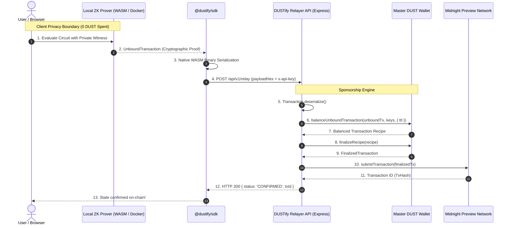

# 🌙 DUSTify — Zero-Friction DUST Relayer & Fee-Abstraction Infrastructure

[](https://github.com/yashannadate/DUSTify/actions/workflows/ci.yml)
[](https://midnight.network)
[](https://opensource.org/licenses/MIT)
[](https://www.typescriptlang.org/)

**DUSTify** is a transaction sponsorship and fee-abstraction infrastructure layer engineered specifically for the **Midnight Network**. It eliminates all gas token hurdles, faucet onboarding friction, and DUST generation latency for dApp end-users by intercepting client-generated Zero-Knowledge (ZK) proofs (`UnboundTransaction`) and sponsoring their on-chain settlement via an authenticated backend Master Relayer.

---

## 📑 Table of Contents

1. [What is DUSTify?](#-what-is-dustify)
2. [The Problem](#-the-problem)
3. [The DUSTify Solution](#-the-dustify-solution)
4. [Architecture & Data Flow](#-architecture--data-flow)
5. [Step-by-Step Transaction Lifecycle](#-step-by-step-transaction-lifecycle)
6. [Architectural Boundaries: What is Handled Locally vs. by Relayer](#-architectural-boundaries)
7. [Security & Trust Model](#-security--trust-model)
8. [Target Network & Configuration](#-target-network--configuration)
9. [Monorepo Structure](#-monorepo-structure)
10. [Local Development Setup (WSL2 Ubuntu)](#-local-development-setup-wsl2-ubuntu)
11. [Running the Relayer API](#-running-the-relayer-api)
12. [Running the Frontend Dashboard](#-running-the-frontend-dashboard)
13. [Client SDK Integration Guide](#-client-sdk-integration-guide)
14. [Smart Contracts & Circuits](#-smart-contracts--circuits)
15. [Product X (Twitter) Profile](#-product-x-twitter-profile)
16. [Current MVP Status & Limitations](#-current-mvp-status--limitations)
17. [Roadmap](#-roadmap)
18. [License](#-license)

---

## 🌟 What is DUSTify?

In traditional Web3 applications and privacy blockchains like Midnight, users must acquire native gas tokens (DUST) and set up cryptographic fee wallets before they can execute a single transaction.

**DUSTify abstracts this entire process away.**

With DUSTify:
- Users need **0 DUST**, 0 NIGHT tokens, and 0 faucet navigation.
- Users evaluate Compact ZK circuits locally (preserving 100% witness privacy under the **Kachina Protocol**).
- The client SDK dispatches the un-gas-backed `UnboundTransaction` to the DUSTify Relayer.
- The Relayer backend executes `balanceUnboundTransaction()`, attaches fee UTXOs from a funded Master DUST Wallet, seals the `FinalizedTransaction` with `finalizeRecipe()`, and broadcasts it to the Midnight Preview Network.

---

## 🛑 The Problem

Building accessible dApps on Midnight presents a unique user onboarding challenge:

1. **Faucet & Token Friction:** New users must discover a testnet faucet, request `tNIGHT`, and wait for block confirmations.
2. **DUST Generation Lag:** In Midnight's dual-token model, DUST capacity is generated over time from registered NIGHT UTXOs. Users cannot transact immediately even after receiving tokens.
3. **High User Drop-Off:** For simple actions (voting in a DAO, signing an identity proof, posting a message), forcing users to navigate crypto faucets causes over 80% abandonment.

---

## ⚡ The DUSTify Solution

DUSTify provides a complete **Fee-Abstraction and Meta-Transaction Engine**:

- **0 DUST Onboarding:** End-users can interact with Midnight dApps on second zero without having tokens.
- **Client Witness Privacy Intact:** Private inputs and witness generation remain exclusively inside the user's browser/client runtime.
- **Warm Sync Persistence:** The Relayer serializes wallet checkpoints to `.data/wallet-state/preview`, enabling warm restarts and synchronizations in **~1.4 seconds**.
- **Developer-Ready SDK:** dApp builders add gasless sponsorship using a 3-line `@dustify/sdk` integration.

---

## 🏗️ Architecture & Data Flow



---

## 🔄 Step-by-Step Transaction Lifecycle

1. **User Action:** The user triggers a contract interaction on the dApp interface (e.g. casting a vote or posting a message).
2. **Local Proving (0 DUST):** The client invokes Midnight's `createUnprovenCallTx` and passes it to the proof provider. The ZK proof is computed locally.
3. **Binary Serialization:** `@dustify/sdk` serializes the `UnboundTransaction` into a raw binary payload.
4. **Relayer Authentication:** The serialized payload is sent to `POST /api/v1/relay` accompanied by the dApp's `x-api-key`.
5. **Fee Attachment:** The Relayer calls `wallet.balanceUnboundTransaction()` using the Master Wallet's secret keys, supplying the necessary DUST fee inputs without altering the user's proof or witness.
6. **Recipe Finalization:** The Relayer runs `wallet.finalizeRecipe()` to seal the balanced transaction.
7. **Node Submission:** The Relayer broadcasts the transaction via `wallet.submitTransaction()` to the Midnight Preview Node RPC.
8. **Confirmation:** The transaction is settled on the Midnight ledger, and the confirmed transaction ID is returned to the user.

---

## 🔒 Architectural Boundaries

> [!IMPORTANT]
> **What DUSTify Eliminates (Our Scope):**
> DUSTify eliminates all DUST wallet creation, tNIGHT token acquiring, faucet navigation, and gas fee payment friction for end users.

> [!NOTE]
> **What DUSTify Preserves (Midnight Kachina Protocol):**
> DUSTify does **NOT** replace client-side private witness evaluation. Midnight's privacy model mandates that secret keys and witness inputs remain exclusively on the user's machine. DUSTify only intercepts the resulting proof and sponsors its gas settlement.

| Concern | Handled Locally (User Client) | Handled by DUSTify Relayer |
| :--- | :---: | :---: |
| User Private Witness | ✅ (100% Private) | ❌ (Never Shared) |
| ZK Proof Generation | ✅ | ❌ |
| Application Private State | ✅ | ❌ |
| DUST Token Balance | ❌ (0 DUST Required) | ✅ (Sponsored) |
| Gas Fee Optimization | ❌ | ✅ |
| Transaction Broadcast | ❌ | ✅ |

---

## 🛡️ Security & Trust Model

1. **Zero Key Exposure:** The Relayer never receives private keys, secret seed phrases, or witness variables from users.
2. **Tamper-Proof Proofs:** Because the client sends a cryptographically sealed `UnboundTransaction`, the Relayer cannot modify the application payload or witness without invalidating the ZK proof.
3. **API Key & Origin Guarding:** Relayer endpoints are protected by `x-api-key` validation and browser CORS origin checking.
4. **In-Memory Rate Limiting:** Built-in IP rate limiter prevents transaction spamming and protects sponsor wallet reserves.

---

## 🌙 Target Network & Configuration

Configured out of the box for the **Midnight Preview** network:

| Variable | Midnight Preview Default Value | Description |
| :--- | :--- | :--- |
| `MIDNIGHT_NETWORK` | `preview` | Midnight Network ID (`preview` / `preprod` / `undeployed`) |
| `INDEXER_HTTP_URL` | `https://api-preview.1am.xyz/api/v4/graphql` | Preview Indexer GraphQL HTTP Endpoint |
| `INDEXER_WS_URL` | `wss://api-preview.1am.xyz/api/v4/graphql/ws` | Preview Indexer WebSocket Endpoint |
| `NODE_RPC_URL` | `wss://rpc.preview.midnight.network` | Midnight Preview Node RPC Endpoint |
| `PROOF_SERVER_URL` | `http://127.0.0.1:6300` | Local/Remote Proof Server Endpoint |
| `MASTER_WALLET_SEED` | `[SECURE_SEED_PHRASE]` | Relayer Sponsor Master Wallet Seed Phrase |
| `DUSTIFY_API_KEY` | `dustify_dev_key_preview_2026` | API Key for Relayer Authentication |
| `ALLOWED_ORIGINS` | `http://localhost:5173,http://localhost:3000` | CORS Allowed Origins |
| `RATE_LIMIT_MAX` | `100` | Max requests per minute per IP |

---

## 📁 Monorepo Structure

```
DUSTify/
├── client-sdk/          # @dustify/sdk client library (TypeScript)
│   ├── src/
│   │   ├── DustifyClient.ts
│   │   └── index.ts
│   ├── package.json
│   └── tsconfig.json
├── relayer-api/         # DUSTify Master Relayer Backend (Express + Midnight SDK)
│   ├── src/
│   │   ├── config.ts
│   │   ├── index.ts
│   │   ├── middleware/auth.ts
│   │   └── services/midnight.ts
│   ├── package.json
│   └── tsconfig.json
├── frontend/            # React + Vite + Tailwind CSS Developer Dashboard & Demo
│   ├── src/
│   │   ├── components/
│   │   │   ├── Navbar.tsx
│   │   │   ├── HeroSection.tsx
│   │   │   ├── FlowVisualizer.tsx
│   │   │   ├── DemoExecutionSection.tsx
│   │   │   ├── RelayerMonitor.tsx
│   │   │   ├── SdkPlayground.tsx
│   │   │   ├── ComparisonSection.tsx
│   │   │   └── Footer.tsx
│   │   ├── App.tsx
│   │   └── main.tsx
│   ├── package.json
│   └── vite.config.ts
├── contracts/           # Compact Smart Contracts & Managed Assets
│   ├── hello-world.compact
│   ├── Voting.compact
│   └── managed/
├── experiments/         # Real-world Preview Network validation suite
│   ├── preview-validation/
│   └── sponsorship-poc/
├── docs/                # Architecture docs and X (Twitter) launch profile
│   └── x-profile.md
├── .github/workflows/   # CI/CD automated build pipelines
│   └── ci.yml
├── .data/               # Persisted wallet sync state
├── README.md
└── package.json
```

---

## 💻 Local Development Setup (WSL2 Ubuntu)

> [!IMPORTANT]
> **WSL2 Ubuntu Runtime Requirement:**
> The Midnight Network SDK contains native WASM and cryptography bindings that require a Linux environment. Please run backend services inside **WSL2 Ubuntu**.

### 1. Clone the Repository
```bash
git clone https://github.com/yashannadate/DUSTify.git
cd DUSTify
```

### 2. Configure Environment
```bash
cp .env.example .env
```

---

## 🚀 Running the Relayer API

```bash
cd relayer-api
npm install
npm run dev
```

The Relayer API will initialize the Master Wallet, restore persisted checkpoints from `.data/wallet-state/preview`, and listen on `http://localhost:3001`.

### Endpoints
- `GET /api/v1/status` — Operational health, sync status, and DUST balance.
- `POST /api/v1/relay` — Authenticated endpoint for transaction sponsorship.
- `GET /health` — Simple uptime ping.

---

## 🖥️ Running the Frontend Dashboard

```bash
cd frontend
npm install
npm run dev
```

Open `http://localhost:5173` to access the interactive DUSTify Dashboard.

---

## 📦 Client SDK Integration Guide

### 1. Install SDK
```bash
npm install @dustify/sdk
```

### 2. Submit Gasless Transaction
```typescript
import { DustifyClient } from '@dustify/sdk';

const dustify = new DustifyClient({
  relayerUrl: 'http://localhost:3001',
  apiKey: 'dustify_dev_key_preview_2026',
});

// 1. User proves circuit locally (0 DUST spent)
const unboundTx = await proofProvider.proveTx(unprovenTx);

// 2. Relay directly to DUSTify
const receipt = await dustify.sponsorAndSubmit(unboundTx, 'storeMessage');

console.log('Confirmed on Midnight Preview! TxId:', receipt.txId);
console.log('Sponsored DUST fee:', receipt.sponsoredDustFee);
```

---

## 📜 Smart Contracts & Circuits

### Voting.compact (Gasless Governance)
```compact
pragma language_version >= 0.22;
import CompactStandardLibrary;

export ledger proposalVotes: Map<Field, Uint<32>>;

export circuit castVote(proposalId: Field, voterHash: Bytes<32>): [] {
    // Verified locally; sponsored on-chain via DUSTify
}
```

### hello-world.compact (State Storage)
```compact
pragma language_version >= 0.22;
import CompactStandardLibrary;

export ledger message: Opaque<"string">;

export circuit storeMessage(customMessage: Opaque<"string">): [] {
    message = disclose(customMessage);
}
```

---

## 🐦 Product X (Twitter) Profile

Official product profile metadata and launch thread are documented in [`docs/x-profile.md`](file:///d:/DUSTify/docs/x-profile.md).

- **Description:** *"DUSTify is a gas abstraction and transaction sponsorship layer for Midnight. Users generate proofs locally while a relayer sponsors DUST fees, enabling smoother faucet-less onboarding for Midnight applications."*
- **Hashtags:** `#MidnightNetwork #ZeroKnowledge #Web3UX #Privacy`

---

## 📊 Current MVP Status & Limitations

In the spirit of technical honesty:
- **Preview Connectivity:** Fully verified with live Midnight Preview Indexer and Node RPC.
- **Wallet Persistence:** Fully verified; warm state restore completes in **~1.4 seconds**.
- **Transaction Pipeline:** Fully implemented using verified SDK methods (`balanceUnboundTransaction` -> `finalizeRecipe` -> `submitTransaction`).
- **Sponsor Funding:** When the sponsor wallet has 0 DUST, the relayer safely returns `RELAYER_NOT_FUNDED` with clear diagnostic status rather than faking an on-chain receipt.

---

## 🗺️ Roadmap

- [x] Level 4 MVP with Relayer API, Client SDK, and React Dashboard
- [x] State persistence with ~1.4s warm sync
- [x] Binary WASM payload serialization and deserialization
- [ ] Multi-tenant sponsor pool with dynamic DUST replenishment
- [ ] Decentralized Relayer Network with stake-based slashing
- [ ] Mainnet deployment and audit

---

## 📄 License

MIT License &copy; 2026 Yash Annadate & DUSTify Contributors.
